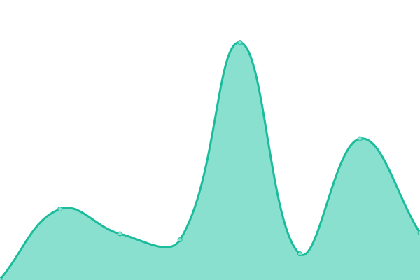
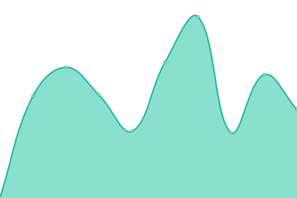
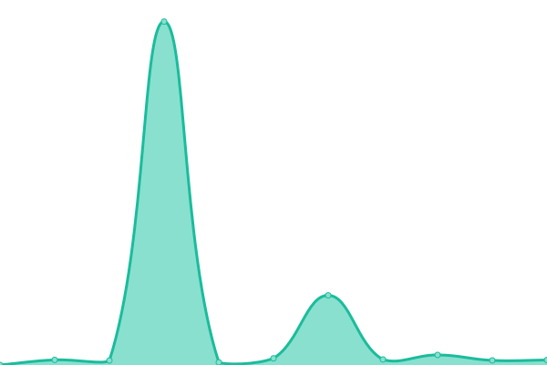

# [📈 Live Status](https://kayketeixeira.github.io/upptime): <!--live status--> **🟧 Partial outage**

This repository contains the open-source uptime monitor and status page for [Kayke Teixeira](https://www.linkedin.com/in/kayketeixeira/), powered by [Upptime](https://github.com/upptime/upptime).

With [Upptime](https://upptime.js.org), you can get your own unlimited and free uptime monitor and status page, powered entirely by a GitHub repository. We use [Issues](https://github.com/kayketeixeira/upptime/issues) as incident reports, [Actions](https://github.com/kayketeixeira/upptime/actions) as uptime monitors, and [Pages](https://kayketeixeira.github.io/upptime) for the status page.

<!--start: status pages-->
<!-- This summary is generated by Upptime (https://github.com/upptime/upptime) -->
<!-- Do not edit this manually, your changes will be overwritten -->
<!-- prettier-ignore -->
| URL | Status | History | Response Time | Uptime |
| --- | ------ | ------- | ------------- | ------ |
|  [GCLOUD](https://status.cloud.google.com) | 🟩 Up | [gcloud.yml](https://github.com/kayketeixeira/upptime/commits/HEAD/history/gcloud.yml) | 

 156ms
     
 | 

<a href="https://kayketeixeira.github.io/upptime/history/gcloud">100.00%</a>
    

|  [AWS](https://status.aws.amazon.com) | 🟩 Up | [aws.yml](https://github.com/kayketeixeira/upptime/commits/HEAD/history/aws.yml) | 

 412ms
     
 | 

<a href="https://kayketeixeira.github.io/upptime/history/aws">100.00%</a>
    

|  [GITHUB](https://www.githubstatus.com) | 🟥 Down | [github.yml](https://github.com/kayketeixeira/upptime/commits/HEAD/history/github.yml) | 

 201ms
     
 | 

<a href="https://kayketeixeira.github.io/upptime/history/github">99.65%</a>
    

|  [NewRelic](https://status.newrelic.com) | 🟥 Down | [new-relic.yml](https://github.com/kayketeixeira/upptime/commits/HEAD/history/new-relic.yml) | 

 215ms
     
 | 

<a href="https://kayketeixeira.github.io/upptime/history/new-relic">99.65%</a>
    

|  [Dead Mans Snith](https://status.deadmanssnitch.com) | 🟥 Down | [dead-mans-snith.yml](https://github.com/kayketeixeira/upptime/commits/HEAD/history/dead-mans-snith.yml) | 

 390ms
     
 | 

<a href="https://kayketeixeira.github.io/upptime/history/dead-mans-snith">99.65%</a>
    

<!--end: status pages-->

[**Visit our status website →**](https://kayketeixeira.github.io/upptime)

## 📄 License

- Powered by: [Upptime](https://github.com/upptime/upptime)
- Code: [MIT](./LICENSE) © [Kayke Teixeira](https://www.linkedin.com/in/kayketeixeira/)
- Data in the `./history` directory: [Open Database License](https://opendatacommons.org/licenses/odbl/1-0/)
